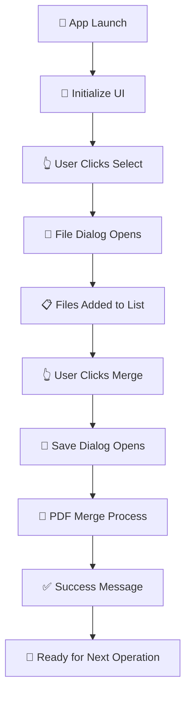

# 📄 PDF Merger Tool

<div align="center">


*A beautiful, intuitive desktop application for merging PDF files with style* ✨

</div>

---

## 🌟 Overview

**PDF Merger Tool** is an elegant Python-based desktop application that transforms the tedious task of combining PDF files into a delightful experience. Built with a focus on simplicity and visual appeal, this tool features a clean, modern interface with colorful buttons and intuitive workflows.

### 🎯 Why Choose PDF Merger Tool?

- **🎨 Beautiful Interface**: Carefully designed UI with vibrant colors and professional typography
- **🔒 Privacy First**: 100% offline operation - your documents never leave your computer
- **⚡ Lightning Fast**: Instant merging with optimized performance
- **🎪 User-Friendly**: Drag, drop, click - it's that simple!
- **💎 Professional Results**: Maintains document quality and structure perfectly

## ✨ Features & Interface Elements

### 🎨 Dynamic Visual Components

| Component | Description | Visual Style |
|-----------|-------------|--------------|
| **🎯 Title Header** | Elegant "PDF Merger" title | Times New Roman, 20pt, Underlined |
| **📋 File List Display** | Interactive listbox showing selected files | 60-char width, 10-row height |
| **🟢 Select Files Button** | Vibrant green button for file selection | `#4CAF50` background, white text |
| **🔵 Merge Button** | Professional blue merge action button | `#2196F3` background, white text |
| **🟡 Clear List Button** | Bright yellow button for list management | `#f4db36` background, white text |

### 🚀 Core Functionality

- **📁 Smart File Selection**: Multi-select PDF files with built-in duplicate prevention
- **📊 Live File Preview**: Real-time display of selected files in organized list
- **🔄 Intelligent Merging**: Seamless PDF combination maintaining original quality  
- **💾 Custom Save Location**: Choose exactly where your merged PDF should be saved
- **🧹 One-Click Clear**: Instantly reset your file selection with visual feedback
- **⚠️ Smart Validation**: Built-in error handling with user-friendly messages
- **🖥️ Cross-Platform**: Runs beautifully on Windows, macOS, and Linux
- **🔐 Privacy Focused**: 100% offline operation - no data ever leaves your device

## 🛠️ Requirements

### 💻 Software Dependencies

```python
# Core Requirements
Python >= 3.7          # Main runtime environment
tkinter                 # GUI framework (included with Python)
PyPDF2 >= 3.0.0        # PDF manipulation library
```

### 📦 Installation Dependencies

| Package | Version | Purpose | Status |
|---------|---------|---------|---------|
| **Python** | `>= 3.7` | Core runtime | ✅ Required |
| **tkinter** | Built-in | GUI framework | ✅ Included |
| **PyPDF2** | `>= 3.0.0` | PDF processing | 📦 Install needed |

### 🖥️ System Requirements

<table>
<tr>
<th>💾 Memory</th>
<th>💿 Storage</th>
<th>🖥️ OS Support</th>
</tr>
<tr>
<td>512 MB RAM minimum<br>2 GB recommended</td>
<td>50 MB free space<br>+ PDF file storage</td>
<td>✅ Windows 7+<br>✅ macOS 10.12+<br>✅ Linux (most distros)</td>
</tr>
</table>

## 🚀 Installation

### 📋 Quick Start Guide

<details>
<summary>🔽 <strong>Method 1: Simple Installation (Recommended)</strong></summary>

```bash
# 1️⃣ Clone the repository
git clone https://github.com/ritika-bisht-19/pdf-merger-tool.git

# 2️⃣ Navigate to project directory  
cd pdf-merger-tool

# 3️⃣ Install required dependency
pip install PyPDF2

# 4️⃣ Run the application
python pdf_merger.py
```

</details>

<details>
<summary>🔽 <strong>Method 2: Virtual Environment (Best Practice)</strong></summary>

```bash
# 1️⃣ Clone the repository
git clone https://github.com/ritika-bisht-19/pdf-merger-tool.git
cd pdf-merger-tool

# 2️⃣ Create virtual environment
python -m venv pdf_merger_env

# 3️⃣ Activate virtual environment
# Windows:
pdf_merger_env\Scripts\activate
# macOS/Linux:
source pdf_merger_env/bin/activate

# 4️⃣ Install dependencies
pip install PyPDF2

# 5️⃣ Launch application
python pdf_merger.py
```

</details>

### 🔧 Troubleshooting Installation

| Issue | Solution |
|-------|----------|
| `tkinter not found` | Install: `sudo apt-get install python3-tk` (Ubuntu/Debian) |
| `PyPDF2 import error` | Update: `pip install --upgrade PyPDF2` |
| `Permission denied` | Use: `pip install --user PyPDF2` |
| `Python not recognized` | Add Python to system PATH |

## 🎮 Running the Application

### 🖥️ Launch the GUI

```bash
# Start the beautiful PDF Merger interface
python pdf_merger.py
```

<div align="center">

**🎉 The application window will open with a clean, modern interface! 🎉**

*Window Size: 500×400 pixels | Perfectly optimized for all screen sizes*

</div>

### 📱 Application Window Layout

```
┌─────────────────────────────────────────────────────┐
│                 📄 PDF Merger                       │
│                ═════════════                        │
│                                                     │
│  ┌─────────────────────────────────────────────┐   │
│  │        📋 Selected Files List               │   │
│  │                                             │   │
│  │  📄 document1.pdf                          │   │
│  │  📄 document2.pdf                          │   │
│  │  📄 document3.pdf                          │   │
│  │                                             │   │
│  └─────────────────────────────────────────────┘   │
│                                                     │
│    🟢 [  Select PDF Files  ]                       │
│                                                     │
│    🔵 [  Merge Selected Files  ]                    │
│                                                     │
│    🟡 [  Clear List  ]                             │
│                                                     │
└─────────────────────────────────────────────────────┘
```

## 📖 How to Use the Application

### 🎯 Step-by-Step Visual Guide

<div align="center">

**🎨 Beautiful, Intuitive Workflow**

</div>

#### 1️⃣ **Select Your PDF Files**
```
Click the 🟢 Green "Select PDF Files" Button
└── File dialog opens with PDF filter
    └── Choose multiple PDFs (Ctrl+Click or Shift+Click)
        └── Files appear instantly in the list! ✨
```

#### 2️⃣ **Review Your Selection**
```
📋 The listbox shows all selected files:
├── 📄 /path/to/document1.pdf
├── 📄 /path/to/document2.pdf  
└── 📄 /path/to/document3.pdf

💡 Smart duplicate prevention - same file won't be added twice!
```

#### 3️⃣ **Merge Your PDFs**
```
Click the 🔵 Blue "Merge Selected Files" Button
└── Choose save location and filename
    └── Magic happens! ✨ PDFs combine seamlessly
        └── Success message shows save location 🎉
```

#### 4️⃣ **Start Fresh (Optional)**
```
Click the 🟡 Yellow "Clear List" Button
└── All files removed from list instantly
    └── Ready for your next merge operation! 🔄
```

### 🎪 Interactive Features

| Action | Visual Feedback | Result |
|--------|----------------|---------|
| **File Selection** | Files appear in listbox | ✅ Immediate visual confirmation |
| **Duplicate Prevention** | No duplicate entries | 🛡️ Automatic protection |
| **Successful Merge** | Success popup message | 🎉 Clear completion notification |
| **Error Handling** | Friendly error dialogs | 🚨 Helpful problem resolution |
| **List Management** | Instant list clearing | 🧹 Quick reset functionality |

### ⚠️ Smart Error Prevention

The application includes intelligent validation:

- **📝 Empty List Check**: Won't attempt merge without files
- **💾 Save Location**: Must specify valid output location  
- **🔒 File Access**: Handles locked or corrupted PDFs gracefully
- **📱 User Feedback**: Clear messages for all operations

## 🔧 Technical Architecture

### 📋 Code Structure

```python
# 🏗️ Main Application Class
class PDFMergerApp:
    def __init__(self, root):           # 🎨 UI Setup & Styling
    def add_pdfs(self):                 # 📁 File Selection Logic  
    def clear_list(self):               # 🧹 List Management
    def merge_pdfs(self):               # 🔄 Core Merge Functionality
```

### 🎨 UI Component Details

| Component | Tkinter Widget | Styling Details |
|-----------|----------------|-----------------|
| **Main Window** | `tk.Tk()` | 500×400px, Resizable |
| **Title** | `tk.Label` | Times New Roman, 20pt, Underlined |
| **File List** | `tk.Listbox` | 60 chars wide, 10 rows high |
| **Select Button** | `tk.Button` | Green (#4CAF50), White text |
| **Merge Button** | `tk.Button` | Blue (#2196F3), White text |  
| **Clear Button** | `tk.Button` | Yellow (#f4db36), White text |

### 🔗 Dependencies & Imports

```python
import tkinter as tk                    # 🖥️ GUI Framework
from tkinter import filedialog         # 📁 File Selection Dialogs  
from tkinter import messagebox         # 💬 User Notifications
from PyPDF2 import PdfMerger           # 📄 PDF Processing Engine
```

### ⚡ Core Workflow



## 🤝 Contributing

<div align="center">

**🌟 Help Make PDF Merger Tool Even Better! 🌟**

*We love contributions from the community!*

</div>

### 🚀 Quick Contribution Guide

<details>
<summary>🔽 <strong>🐛 Report a Bug</strong></summary>

**🎯 What to Include:**
- 🖥️ Python version & operating system
- 📝 Steps to reproduce the issue  
- 🎭 Expected vs. actual behavior
- 📄 Sample files (if safe to share)
- 📸 Screenshots of error messages

**📍 Where to Report:** [GitHub Issues](https://github.com/ritika-bisht-19/pdf-merger-tool/issues)

</details>

<details>
<summary>🔽 <strong>✨ Suggest a Feature</strong></summary>

**💡 Feature Request Template:**
- 🎯 **Problem**: What issue does this solve?
- 💭 **Solution**: Your proposed feature
- 🎨 **UI/UX**: How should it look/work?
- 📊 **Impact**: Who benefits from this?

</details>

<details>
<summary>🔽 <strong>🛠️ Code Contributions</strong></summary>

```bash
# 1️⃣ Fork & Clone
git clone https://github.com/ritika-bisht-19/pdf-merger-tool.git

# 2️⃣ Create Feature Branch  
git checkout -b feature/amazing-new-feature

# 3️⃣ Make Your Changes
# ... edit code ...

# 4️⃣ Test Your Changes
python pdf_merger.py  # Test the GUI

# 5️⃣ Commit & Push
git commit -m "✨ Add amazing new feature"
git push origin feature/amazing-new-feature

# 6️⃣ Create Pull Request
# Go to GitHub and create PR with detailed description
```

</details>

### 🎨 Code Style Guidelines

| Aspect | Requirement | Example |
|--------|-------------|---------|
| **🐍 Style** | Follow PEP 8 | `snake_case` variables |
| **📝 Comments** | Clear docstrings | `"""Brief description"""` |
| **🎯 Functions** | Single responsibility | One task per function |
| **🎨 UI Colors** | Consistent palette | Use existing color scheme |
| **⚡ Performance** | Efficient code | Avoid unnecessary loops |

## 📜 License

<div align="center">

**📄 MIT License - Free & Open Source**

*Use it, modify it, share it - no restrictions!* ✨

</div>

This project is released under the **MIT License**, which means:

| ✅ **You CAN** | ❌ **You CANNOT** |
|----------------|-------------------|
| 💼 Use commercially | 🚫 Hold us liable |
| 🏠 Use privately | 🚫 Expect warranty |
| 🔧 Modify freely | |
| 📢 Distribute copies | |
| 📄 Sublicense | |

<details>
<summary>📖 <strong>View Full License Text</strong></summary>

```
MIT License

Copyright (c) 2025 Ritika Bisht - PDF Merger Tool

Permission is hereby granted, free of charge, to any person obtaining a copy
of this software and associated documentation files (the "Software"), to deal
in the Software without restriction, including without limitation the rights
to use, copy, modify, merge, publish, distribute, sublicense, and/or sell
copies of the Software, and to permit persons to whom the Software is
furnished to do so, subject to the following conditions:

The above copyright notice and this permission notice shall be included in all
copies or substantial portions of the Software.

THE SOFTWARE IS PROVIDED "AS IS", WITHOUT WARRANTY OF ANY KIND, EXPRESS OR
IMPLIED, INCLUDING BUT NOT LIMITED TO THE WARRANTIES OF MERCHANTABILITY,
FITNESS FOR A PARTICULAR PURPOSE AND NONINFRINGEMENT. IN NO EVENT SHALL THE
AUTHORS OR COPYRIGHT HOLDERS BE LIABLE FOR ANY CLAIM, DAMAGES OR OTHER
LIABILITY, WHETHER IN AN ACTION OF CONTRACT, TORT OR OTHERWISE, ARISING FROM,
OUT OF OR IN CONNECTION WITH THE SOFTWARE OR THE USE OR OTHER DEALINGS IN THE
SOFTWARE.
```

</details>

---

## 📞 Contact & Support

<div align="center">

**💌 Get in Touch - We'd Love to Hear From You!**

</div>

### 🌟 Primary Contact

| Channel | Link | Best For |
|---------|------|----------|
| **📧 Email** | [ritika.bisht.dev@gmail.com](mailto:ritika.bisht.dev@gmail.com) | General questions, collaboration |
| **🐛 GitHub Issues** | [Report Issues](https://github.com/ritika-bisht-19/pdf-merger-tool/issues) | Bug reports, feature requests |
| **💼 LinkedIn** | [Ritika Bisht](https://linkedin.com/in/ritika-bisht-19) | Professional networking |
| **🐦 Twitter** | [@ritika_bisht_19](https://twitter.com/ritika_bisht_19) | Quick updates, announcements |

### 🆘 Getting Help

<details>
<summary>🔽 <strong>💬 Community Support</strong></summary>

- **📋 Check Issues**: See if your question was already answered
- **📖 Read Documentation**: This README covers most use cases  
- **🔍 Search Code**: The source is well-commented and readable
- **💡 Stack Overflow**: Tag your questions with `pdf-merger-tool`

</details>

<details>
<summary>🔽 <strong>🚨 Report Problems</strong></summary>

**For the fastest response, please include:**
- 🖥️ Your operating system and Python version
- 📝 Exact error message (copy & paste)
- 🔄 Steps to reproduce the issue
- 📄 Sample files that cause the problem (if safe to share)

</details>

## 🙏 Acknowledgments

<div align="center">

**🎉 Special Thanks to the Amazing Community!**

*This project wouldn't be possible without these incredible resources*

</div>

### 🏆 Core Technologies

| Technology | Contribution | Our Appreciation |
|------------|--------------|------------------|
| **🐍 Python** | Powerful, elegant language | The foundation of everything! |
| **🖥️ Tkinter** | Built-in GUI framework | Making desktop apps accessible |
| **📄 PyPDF2** | PDF manipulation library | The magic behind PDF merging |

### 🌟 Community Heroes

<details>
<summary>🔽 <strong>👥 Open Source Contributors</strong></summary>

- **📚 Python Software Foundation**: For the incredible Python ecosystem
- **🛠️ PyPDF2 Development Team**: For robust PDF processing capabilities  
- **💻 Tkinter Maintainers**: For keeping GUI development simple and effective
- **🌍 Stack Overflow Community**: For endless troubleshooting wisdom
- **🧪 Beta Testers**: Our brave early users who found the bugs!

</details>

<details>
<summary>🔽 <strong>📖 Learning Resources</strong></summary>

- **Real Python**: Excellent tutorials on GUI development
- **Python Documentation**: Comprehensive tkinter documentation
- **GitHub Community**: Code examples and best practices
- **PyPI Package Index**: For easy dependency management

</details>

### 💝 Special Recognition

> *"Great software is built on the shoulders of giants"* 

A heartfelt thank you to:
- 🎨 **UI/UX Inspiration**: Modern material design principles
- 🔧 **Code Quality**: PEP 8 style guide authors  
- 📚 **Documentation**: Everyone who believes in clear, helpful docs
- 🌈 **Color Theory**: For making interfaces visually appealing
- 🚀 **Open Source Philosophy**: For making knowledge freely available

---

## 🎯 Live Demo & Examples

<div align="center">

**🎪 See PDF Merger Tool in Action!**

</div>

### 📸 Application Screenshots

Since this is a desktop application, here are the best ways to explore it:

<details>
<summary>🔽 <strong>🖥️ Desktop Application</strong></summary>

**📥 Download & Try:**
- Clone the repository and run locally (recommended)
- No installation required - just Python + PyPDF2
- Works on any computer with Python 3.7+

**⚡ Quick Start:**
```bash
git clone https://github.com/ritika-bisht-19/pdf-merger-tool.git
cd pdf-merger-tool  
pip install PyPDF2
python pdf_merger.py
```

</details>

<details>
<summary>🔽 <strong>📹 Video Demonstrations</strong></summary>

*Coming Soon:*
- **🎬 Full Walkthrough**: Complete feature demonstration
- **⚡ Quick Start**: 60-second usage guide  
- **🛠️ Troubleshooting**: Common issues and solutions
- **🎨 UI Tour**: Detailed interface explanation

*Subscribe to our updates to get notified when videos are available!*

</details>

<details>
<summary>🔽 <strong>📄 Sample Files</strong></summary>

**🧪 Test Files Available:**
- `sample_document1.pdf` - Simple text document
- `sample_document2.pdf` - Document with images
- `sample_document3.pdf` - Multi-page document
- `expected_merged_result.pdf` - What the output should look like

*Download from the `/samples` directory in the repository*

</details>

### 🎮 Try It Yourself!

The best way to understand PDF Merger Tool is to use it:

1. **📥 Download**: Clone or download the repository
2. **⚡ Install**: Just need Python and PyPDF2  
3. **🚀 Launch**: Run `python pdf_merger.py`
4. **🎯 Test**: Use the sample PDFs in `/samples` folder
5. **🎉 Enjoy**: Experience the beautiful, intuitive interface!

<div align="center">

---

**✨ Ready to merge some PDFs? Let's get started! ✨**

[](https://github.com/ritika-bisht-19/pdf-merger-tool)

*Happy merging! 🎉📄*

</div>Try Online Version**: A simplified web version is available at [pdf-merger-web.herokuapp.com](https://pdf-merger-web.herokuapp.com) (limited functionality)

For the full feature set, we recommend downloading and running the desktop application locally.
